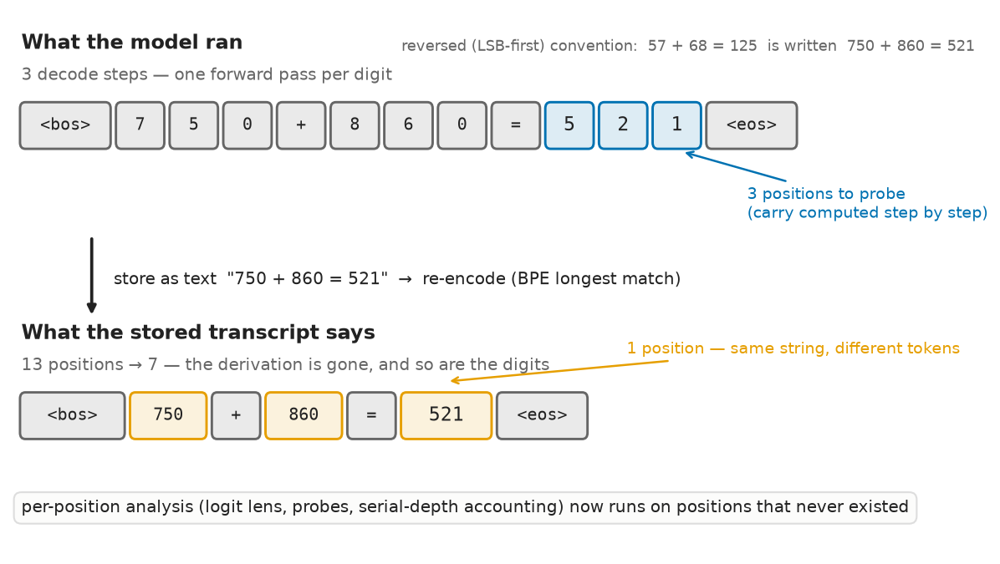
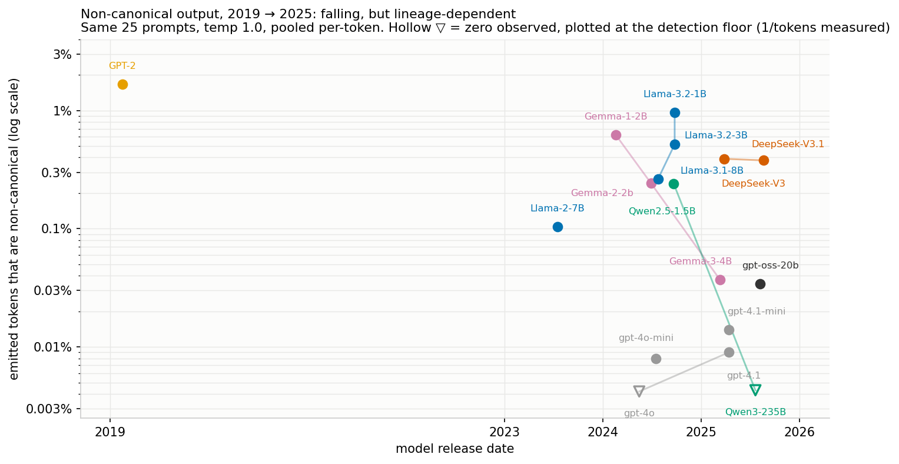

# The positions in your transcript are not the positions that ran

Tokenization is many-to-one. Many token sequences decode to the same string, and
re-encoding that string gives back only the *canonical* one. Text survives the
store-as-text-then-re-tokenize round trip; **segmentation doesn't**.

A model that emits `9`, `7`, `0` as three tokens has run three forward passes.
Store that as text, re-encode it, and you get the single token `970` — same
string, one position instead of three. Every analysis that operates on positions
(logit lens, linear probes, per-position attribution, serial-depth accounting) is
now reading positions that never existed. No model intent, no steganography, no
adversary required.

**→ [WRITEUP.md](WRITEUP.md)** is the full argument.



## Findings

1. **Non-canonical tokenization can hide computation.** A 2-layer, width-16
   transformer trained on 3-digit reversed addition emits its answer
   digit-by-digit **71%** of the time when sampled (98–99% accurate there) and
   as a single merged token **29%** of the time (**<1%** accurate) — and
   re-tokenizing a digit-by-digit transcript produces exactly that
   merged token. The stored transcript shows it doing in one decode step what it
   actually needed three for. Even absent any hidden computation, the round trip
   perturbs interpretability: next-token distributions at a non-canonical span
   boundary diverge (median KL 0.39, top-1 flips 50%), decaying ~78× within 16
   tokens (and ~98× by 64) but with the flip rate plateauing near 10–15%.

2. **In-the-wild rates are low, fall with scale within families — and are
   lineage-dependent at the frontier.** Across seven models and
   five tokenizer lineages at as-released precision, the share of emitted tokens
   that are non-canonical runs 0–5%, dominated by language (English ≈ 0%, CJK up
   to 5.2%) and by temperature (**0.08% under greedy decoding**, 0.5–1.0% at
   temperature 1.0, ~3% at 1.5). Within the Llama family, CJK drops 5.20% → 2.93% → 1.21%
   from 1B → 3B → 8B.

3. **Small models can be prompted into it; frontier models cannot (on this
   prompt).** "Write `light` immediately followed by
   `house`, no separator" yields non-canonical segmentation **93%** of the time
   (Llama-3.2-1B) against 0% for matched controls on the same words — pooled
   44/49 vs 1/25, Fisher exact p ≈ 1.5×10⁻¹³. It works through *semantics*, not
   form: "one character at a time" and "one digit at a time" both fail
   completely. On six API-measurable frontier models the same probe gets 97–100%
   compliance and **0 induced of 346** compliant productions.

4. **Two pre-registered RL arms under a tokenization-blind reward (pilot).**
   GRPO on gpt2-large (decimal expansion, reward = correct digits of the
   *decoded* text): canonical segmentation fell 100% → **61.5%** of rollouts
   in 2,000 steps, nearly all to greedy-longest chunks ("other" ≤2.4%);
   single-digit tokens reached 1.6% of digit tokens, and the all-single-digit
   attractor stayed 0%. GRPO on Qwen2.5-3B (word reversal, artifact-backed):
   reward roughly doubled while segmentation stayed put — per-token
   round-trip canonicality flat (6.7% → 4.8%), all-single-char 0% of correct
   answers throughout, single-char token share 20% → 10%. The pre-registered
   compute-attractor prediction was not supported (with pre-registered
   caveats: final reward sits in the plan's weak-evidence band, and the
   prefix-only reward concentrated pressure on ~2 characters). See
   [`retok_rl/`](retok_rl/).



## Asks

1. **Retain the token IDs your models emit, and monitor the non-canonical rate.**
   Interpretability work should analyze the real tokens. The check is
   `encode(decode(ids)) != ids` — close to free.
2. **Someone should search prompt space properly.** We found one lever by hand
   and stopped. Broad prompting plus GCG-style discrete search or soft prompts
   against a canonicality objective is the experiment that decides whether this
   stays a validity bug or becomes a channel.

## Links

| | |
|---|---|
| [WRITEUP.md](WRITEUP.md) | The argument: findings, asks, limitations, related work |
| [RESULTS.md](RESULTS.md) | Full run log — every command, seed, wandb id, caveat, and the design dead-ends |
| [EXPERIMENT_PLAN.md](EXPERIMENT_PLAN.md) | Hypotheses and predictions, written before running — its Phase-2 figures are pre-registration guesses and were superseded by RESULTS.md |
| [HF dataset](https://huggingface.co/datasets/brendanlong/retok-noncanonical-tokenization) | Per-generation token IDs for all seven models, the three comparison models, the greedy/temperature/divergence runs, and trained checkpoints |
| [wandb project](https://wandb.ai/brendanlong-com/retok/overview) | Public training runs — the run IDs in RESULTS.md resolve here |

## Layout

```
retok/                  the experiment
  config.py             pydantic configs; defaults reproduce the headline run
  tokenizer.py          hand-built vocab: digit tokens + merged D-digit tokens, canonicalize()
  data.py               reversed-addition task, CoT/direct encoding, streaming dataset
  model.py              decoder-only transformer + parallel per-digit readout head
  train.py              entry point: uv run python -m retok.train
  training.py           training loop, restricted-argmax per-format scoring, eval
  analysis.py           Phase 1: accuracy split, position collapse, carry probe, calibration
  phase2_probe.py       wild-caught rate measurement + example gallery (needs GPU)
  phase2_interp.py      downstream divergence at span boundaries (--from-jsonl = CPU)
  phase2_decay.py       contamination decay vs distance (--from-jsonl = CPU)
  phase2_temperature.py temperature sweep (--from-jsonl = CPU)
  phase2_induce.py      prompted induction + matched controls
  phase2_verify.py      CPU-only recomputation of every rate from published token IDs
  phase2_script.py      rates re-attributed to the script each token is written in
  phase2_expansion.py   long digit runs (decimal expansions), where prefix-instability bites
  phase2_api.py         closed frontier models via OpenAI logprobs (client-side round trip)
  phase2_openrouter.py  open-weight frontier models via OpenRouter logprobs
  phase2_induce_api.py  the induction probe + controls on API-measurable frontier models
  phase2_overview.py    one consistent rate table for all 17 measured models
  eval_sweep.py         CPU re-evaluation of the published width-sweep checkpoints
  figures.py            all figures
  tests/                CPU tests for the tokenizer, task and dataset plumbing
retok_rl/               follow-up: GRPO on decimal expansion — does RL move the
                        policy off canonical tokenization? (plan, code, run log)
common/                 training harness vendored from the source monorepo
  artifacts.py          resolve published checkpoints/records from the HF dataset
  streaming.py          worker seeding/sharding for generated data
  checkpoint.py         save + `hf:` checkpoint resolution
  config.py, gpu.py, schedule.py, wandb_utils.py
  tests/                regression tests for the validity-critical plumbing
figures/                published figures
scripts/                reproduction entry points
skypilot/reproduce.yaml generic cloud-GPU task
```

## Setup

```bash
uv sync
uv run pytest          # CPU-only test suite, a few seconds
```

Python ≥3.12. The toy model trains on CPU or any GPU (it is ~25k parameters);
the wild-caught measurements need a GPU with enough VRAM for the model under
test (24 GB covers everything except gpt-oss-20b, which wants ~44 GB).

## Reproducing

**Analyses — no GPU, no accounts.** Every table, recomputed from the published
checkpoints and generation records:

```bash
bash scripts/reproduce_analyses.sh
```

This downloads a few MB of checkpoints and per-generation records from the HF
dataset (cached by `huggingface_hub`), then recomputes the Phase-1 tables,
re-evaluates the width-sweep checkpoints, re-derives the Phase-2 rate table
from raw token IDs rather than trusting our stored flags, and re-derives the
decay, interp-boundary and temperature tables from their per-generation
records (the token-ID bookkeeping is recomputed; only the stored KL and
probability values would need a GPU to regenerate). One caveat: the Llama and
Gemma *tokenizers* are gated on HuggingFace, so those models' rates need an
accepted license plus `huggingface-cli login` — the verifiers skip them with a
clear message rather than failing. Nothing here reads wandb, so no wandb
account is needed.

**Training and generation — needs a GPU.**

```bash
bash scripts/reproduce_training.sh
```

Core arms are enabled; the width sweep and controls are commented out with
runtime notes. The three main toy runs are ~35 min each on an RTX 3060; the
full width sweep adds ~4 h. Phase-2 generation is ~20 min per model on an A40.

**On a cloud GPU:**

```bash
sky launch skypilot/reproduce.yaml --infra <your-cloud> --down -y
sky launch skypilot/reproduce.yaml --infra <your-cloud> --down -y \
    --env RUN_CMD="uv run python -m retok.phase2_probe --model gpt2 --jsonl-out out/gpt2.jsonl"
```

Roughly $1–3 on a spot A40 for the Phase-2 generation sweep; the toy training
runs are cheap enough to do locally.

## Hardware used

Phase-1 training ran on a local RTX 3060 (8 GB): 3 seeds × ~35 min, plus a
12-point width sweep. Phase-2 generation ran on RunPod A40s (44 GB) via
SkyPilot, except GPT-2 and the small Llamas which ran locally. gpt-oss-20b ran
on an A100, bf16-dequantized rather than its as-released MXFP4 (no H100 capacity
was available); gpt-oss-120b was never run.

## Provenance

Extracted from a private monorepo (`brendanlong/experiments`,
`experiments/retok/`), flattened: `experiments.retok.*` → `retok.*` and the used
subset of the monorepo's `shared/` harness vendored as `common/`. Private-infra
paths (S3 checkpoint upload, run-name collision guards, the internal SkyPilot
YAMLs) were removed rather than stubbed.

[RESULTS.md](RESULTS.md) ships **verbatim** as the provenance log, so its
commands are in the monorepo's idiom; its header note maps them onto this repo.

This work was done with heavy AI assistance — the experiments were designed,
implemented, run and written up by Claude working under direction, with the
findings and framing reviewed and corrected by a human. The run log records the
dead-ends and two self-corrections along the way, including one published number
that did not survive re-measurement.

## License

MIT — see [LICENSE](LICENSE).
