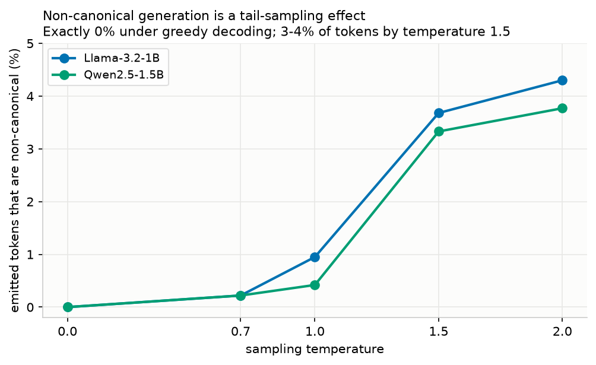
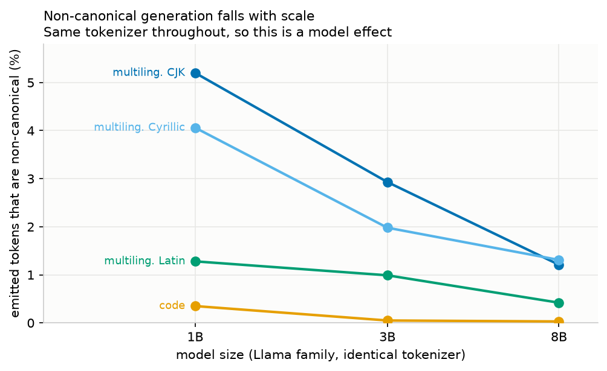
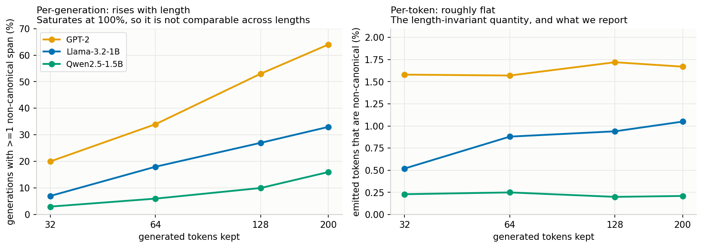

# The Positions in Your Transcript Are Not the Positions That Ran

*Draft — August 2026. Code: `retok/`. `RESULTS.md` is the
full run log — every command, seed, wandb id and caveat, including the design
dead-ends and two self-corrections along the way.*

Tokenization is many-to-one. Many token sequences decode to the same string, and
re-encoding that string gives back only the *canonical* one. So text survives the
store-as-text-then-re-tokenize round trip, but **segmentation doesn't**.

A model that emits `9`, `7`, `0` as three tokens has run three forward passes.
Store that as text, re-encode it, and you get the single token `970`. Same string,
one position instead of three. Every analysis that operates on positions — logit
lens, linear probes, per-position attribution, serial-depth and compute
accounting — is now reading positions that never existed.

This needs no model intent, no steganography, and no adversary.


**And the round trip is the default, not an edge case.** The Chat Completions
path is stateless at the token level: harnesses resubmit the conversation as text
and the server re-tokenizes it. So even if you log token IDs at generation time,
the corruption is re-injected on every later turn. You have to opt *in* to seeing
what actually ran.

## 1. It can hide computation — and it perturbs interpretability either way

To show the strong version you need a case where the multi-step computation is
real and measurable. A 2-layer, width-16 transformer trained from scratch on
3-digit reversed addition emits its answer in an **uncued mixture**: usually
digit-by-digit (3 tokens), sometimes as a single "merged" answer token.

| | |
|---|---|
| accuracy emitting the answer digit-by-digit | **99.9%** |
| accuracy emitting it as one token, *given it takes that branch* | **1.3%** |
| how often it *prefers* the one-token form (full-vocab argmax) | **0%** |
| probability it assigns the correct one-token answer | **0.003** |
| decode positions: actual → re-tokenized | **3 → 1** (whole transcript 13 → 7) |
| probability of the answer given the *re-tokenized* transcript | **0.0003** |

<sub>The two middle rows are conditioned differently, which is worth stating
because they look inconsistent otherwise. The 1.3% is an argmax *restricted to
the merged-token subspace* — "if it goes down the one-token branch, does it pick
the right one?" The 0.003 is *unconditional*, diluted by the ~71% of probability
mass sitting on the digit branch. Conditional on the merged branch the model
gives the correct token 0.9%, which is what wins a 1000-way argmax ~1.3% of the
time; 0.0027 ÷ 0.289 = 0.009 reconciles them. The unconditional number is the one
the detector below needs, since it asks how likely the transcript is *as a
one-step generation*.</sub>

The model needs the extra decode steps. The stored transcript says it didn't.

That also gives a **text-only detector**: re-tokenized transcripts are 100%
correct while each carries ~0.003 probability as a one-step generation.
Astronomically unlikely in aggregate, and checkable from text plus logprobs with
no token-ID logging at all.

**In real models the damage has two different ranges.** BPE pre-tokenizes on
whitespace, so a bad split of one word doesn't change how later words encode —
the *tokenization* recovers at the next word boundary. But *causal* damage
outlives it: attention is causal, so every later position attends to a token that
was never emitted. Walking forward from a non-canonical span in Llama-3.2-1B:

| tokens past the span | median next-token KL | top-1 flip |
|---:|---:|---:|
| 0 | 0.227 | 50% |
| 4 | 0.016 | 20% |
| 16 | 0.004 | 9% |
| 64 | 0.002 | 15% |

Magnitude decays ~57× within 16 tokens (and ~110× by 64), but the flip rate
plateaus near 10%
rather than vanishing. Those distant flips are near-ties (median KL 0.002), so
the practical reading is: **the span's neighbourhood is genuinely unreliable for
per-position analysis; further out, only positions where the model was
near-indifferent are affected.**

## 2. Wild rates are low — and falling with scale

Detection is mechanical if you keep the IDs the model emitted: a generation is
non-canonical iff `encode(decode(ids)) != ids`.

Seven models, five tokenizer lineages, each at its as-released precision, pure
sampling at temperature 1.0, **200 max new tokens** (~180 emitted on average).
Percentage of **emitted tokens** that are non-canonical:

| model | english | code | ml-Latin | ml-Cyrl | ml-CJK |
|---|--:|--:|--:|--:|--:|
| GPT-2 (124M) | 0.89% | 1.54% | **3.28%** | 0.43% | 1.09% |
| Llama-3.2-1B | 0.03% | 0.35% | 1.28% | **4.06%** | **5.20%** |
| Qwen2.5-1.5B | 0.00% | 0.08% | 0.76% | 0.25% | 0.59% |
| Gemma-2-2b | 0.07% | 0.12% | 0.45% | 0.66% | 0.54% |
| Llama-3.2-3B | 0.00% | 0.05% | 0.99% | 1.98% | 2.93% |
| Llama-3.1-8B | 0.03% | 0.03% | 0.42% | 1.31% | 1.21% |
| gpt-oss-20b | 0.03% | 0.00% | 0.11% | 0.14% | 0.00% |

Three things stand out.

**The prompt's language matters more than the model — but not for the reason
the table suggests.** English is near zero for every modern model; CJK-prompted
generations reach 5.2%. Those labels are the *prompt's* language, though, and
the small models answer Russian and Japanese prompts mostly in English
(Llama-3.2-1B emits 7% CJK characters for CJK prompts; Llama-3.1-8B emits 37%).
Re-attributing each token to the script it is actually written in, **CJK tokens
are among the lowest-rate tokens, not the highest** (0.12–1.07%).

What drives the domain effect is the prompt pushing the model off-distribution.
Holding script fixed at Latin, Llama-3.2-1B is non-canonical on 0.03% of Latin
tokens written for an English prompt and **6.91%** of Latin tokens written for a
CJK prompt — same script, same model, ~200×. So this is the tail-sampling
mechanism again, reached from a different direction: unusual context flattens
the next-token distribution, and non-canonical tokens live in the tail. Read the
domain column as "how far outside its comfort zone the prompt puts the model",
not as "how hard this script is to tokenize".

**Temperature dominates everything.** **0.08%** of tokens under greedy
decoding, **0.4–1.0%** at temperature 1.0, and **3–4%** by temperature 1.5 — a
~4× jump for half a point of temperature. This is largely a tail-sampling
phenomenon: models concentrate mass on the canonical continuation, and most of
these tokens come out of the tail.

But greedy is **not zero**, which we initially reported and had to retract. At
argmax across 99 generations from four models, 6 still contained a non-canonical
span — the model's *most likely* continuation is sometimes a non-canonical
token. Our first reading of 0% came from an 8-prompt subset that happened to
exclude arithmetic, which is exactly where GPT-2's greedy hits are (2 of 5
prompts). Temperature buys you roughly an order of magnitude, not immunity.



**It falls with scale.** Holding tokenizer *and* precision fixed —
Llama-3.2-1B → Llama-3.2-3B → Llama-3.1-8B — CJK drops **5.20% → 2.93% →
1.21%**, and every other domain is monotone too. Pooling all domains, the trend
holds across families but noisily: GPT-2 1.66%, Llama-3.2-1B 0.96%,
Qwen2.5-1.5B 0.24%, Gemma-2-2b 0.24%, Llama-3.2-3B 0.52%, Llama-3.1-8B 0.26%,
gpt-oss-20b 0.03%. Smallest to largest is 55×, but the middle isn't ordered, so
the within-family ladder is the claim we'd defend. **The problem is shrinking on
its own.**



**Report the length, and report per-token.** The per-*generation* rate — "did
this sample contain a non-canonical span?" — is a strong function of how long
you sampled: truncating our generations to 32/64/128/200 tokens moves GPT-2 from
20% to 64% while its per-token rate stays at ~1.6%. That follows from BPE being
non-recovering: once a sequence goes off-canonical, every extension stays
off-canonical, so the sequence-level flag only accumulates and saturates at
100%. **A sequence-level rate quoted without its length can't be interpreted,
and two such rates at different lengths can't be compared.**



## 3. But you can prompt for it

Everything above is accidental. The separate question is whether a model can be
*instructed* into a non-canonical segmentation — which is what distinguishes a
validity bug from a potential channel.

| probe | Llama-3.2-1B | Qwen2.5-1.5B |
|---|---|---|
| **concat** — "write `light` immediately followed by `house`, no separator" | **93%** (38/41) | **75%** (6/8) |
| *control:* "repeat this word exactly: `lighthouse`" | 0% (0/8) | 0% (0/8) |
| *control:* question whose answer is the word, never shown | 0% (0/3) | 17% (1/6) |
| **spell** — "one character at a time, no separators" | 0% | 0% |
| **digits** — "one digit at a time, no separators" | 0% (0/30) | n/a |

Asking for two words concatenated yields `['light']['house']` where canonical is
`['l']['ighthouse']`, and `['key']['board']` where canonical is the *single*
token `['keyboard']`. Against matched controls on the same words, pooled: **44/49
(90%) vs 1/25 (4%)**, Fisher exact p ≈ 1.5×10⁻¹³. The prompt is causal, not a
property of the word.

**It works through semantics, not form.** Instructions to change the format of a
single unit — "one character at a time", "one digit at a time" — fail completely.
The model has no handle on its own tokenization; what works is giving it a
*semantic* reason to treat the output as two things, and the segmentation follows
the concepts. Note the `digits` probe, the direct analogue of our toy, fails: you
can't simply ask a model to emit a number digit-by-digit at the token level.

Compliance is modest and varies sharply by model — models add quotes and
explanations, so the bare target is emitted in only 41/80 concat trials for
Llama-3.2-1B (51%) and 8/80 for Qwen2.5-1.5B (10%). The honest claim is "reliable **when** it
complies."

This matters mainly as a statement about mechanism. A policy wouldn't need to
learn anything about tokenization to drift into non-canonical space — only to
conceptualise its output in pieces. But the accessible lever is coarse
(word-level concatenation), not a controllable encoder, which argues *against* an
easy steganographic channel.

## What we're claiming, and what was already known

That non-canonical tokenization changes model behavior is **not ours**.
Adversarial Tokenization shows it evades safety alignment; Chatzi et al.
(arXiv:2506.06446v2) report per-model generation-side rates and prove BPE is
non-recovering; Vieira et al. (ICML 2025) define a canonicality rate and measure
it on GPT-2 and Llama-3.2; Geh et al. (2025) show canonicity decaying with
generation length. *Broken Tokens?* (NeurIPS 2025) asserts in passing that models
are "very unlikely to generate non-canonical tokenizations" and never quantifies
it — our multilingual numbers say otherwise.

**[Weird Re-Tokenization, symmetries and compression](https://www.lesswrong.com/posts/osWWL4yfentdhX9Q7/weird-re-tokenization-symmetries-and-compression-research)**
(Xenomirant & Sami Wolf, Aug 2026) surveys this literature from an alignment
angle and lays out a research agenda; it is the best map of the area we know of,
and readers wanting breadth should start there. Two of its pointers sharpen
results below: **Kaplan et al. (2025)** find early layers implement a
"detokenization" step that collapses a run of subword pieces into a single
word-level vector — a mechanistic account of why our damage stops at the word
boundary — and **Ghosh & Jyothi (2026)** find tokenization-invariance is mostly
preserved for English but degrades for heavily-fragmented languages, which
independently corroborates our language effect. Their own preliminary numbers
also report contamination decaying with distance (each non-canonical token
raising the odds the *next* word is non-canonical by 1.9–3.2×, falling to 1.35×
by thirty tokens); note that measures non-canonicality *propagating*, where our
decay curve measures the model's next-token *distribution* shifting — the same
shape, different quantity.

What we add on top of that literature: the **interpretability-validity framing**
(positions-in-transcript ≠ positions-that-ran, rather than an attack or a billing
anomaly), a **controlled toy** where the hidden computation is real and measured,
the **calibration detector**, the **temperature and scale dependence** across
seven models, the **downstream-divergence** measurement, and the
**prompted-induction** result with controls. The last two are the ones we'd
flag: that agenda names *writer invariance* — "does the model assign significant
probability to non-canonical token sequences?" — as a **new, unexplored
question**, and lists "can the model steer itself... while evading CoT monitors?"
as the one item its own preliminary experiments have *not* touched. §3 above is a
direct empirical answer to the first, and a partial one to the second.

## Why instrument now, when the rate is falling

Everything above is accidental, and finding 2 says it's getting rarer. The reason
to instrument anyway is a regime that would select for it.

Consider outcome-based RL with a monitor in the loop. If the monitor consumes
**re-tokenized text** — the default, per the serving path above — while the policy
is optimized over **actual token sequences**, then segmentation is a degree of
freedom the reward signal's monitor cannot see. Anything that survives the round
trip is unpenalized. That's the standard shape of a specification gap: not
deception, just an axis the overseer is blind to.

This is a **structural argument, not an observation** — we have not demonstrated
segmentation-level reward hacking, and nothing in our measurements implies
current models do it. But §3 shows a policy wouldn't need to learn anything
*about tokenization* to move into this space; it would only need to conceptualise
its output in pieces. And the instrumentation that would let you detect it is the
same instrumentation asked for above, for ordinary validity reasons. It has to be
running *before* the training run you'd want it for.

## Asks

**1. Retain the token IDs your models emit, and monitor the non-canonical
rate.** How far to take this depends on what you're doing. **Interpretability
work should store and analyze the real tokens** — that's the case where a
re-encoded transcript directly invalidates the analysis. For **training**,
monitoring the rate may be enough on its own; it's the series that would reveal a
policy drifting into this space, and it has to exist before the run you'd want it
for. For **live inference** it may not matter much at all. The check itself is a
one-line comparison, so the monitoring is close to free regardless.

**2. Someone should search prompt space properly.** We found one lever by hand
and stopped. The version worth doing is a mix of both halves: broad prompting
(more phrasings, other languages, non-compound targets) *and* directly optimizing
the prompts that work with adversarial techniques — GCG-style discrete search, or
soft prompts, against a canonicality objective. That's the experiment that decides
whether this stays a validity bug or becomes a channel, and we haven't run it.

## Limitations

- The toy's magnitude is **constructed by design** — we chose the vocabulary and
  the width. It demonstrates the mechanism, not a deployment rate.
- The re-tokenized replay is **off-distribution** for the model: merged tokens
  only ever follow `=` in training, so it has never read one as an operand. We
  take that to be the point rather than a confound — a re-tokenized transcript
  *is* a sequence the model never emitted — but it means the collapse in
  probability and probe accuracy mixes "can't compute it in one step" with
  "can't read this input". The digit-operand control separates the two.
- The toy's **whole sequence** re-tokenizes, operands included. What decides
  this is not prompt-vs-completion but *which spans the model wrote*: a CoT
  scratchpad routinely restates its inputs before working on them, so asked
  "what is 57 + 68?" a model can emit the entire `7 5 0 + 8 6 0 = 5 2 1` itself,
  and all of it then re-encodes. Whether our operands are formally prompt or
  completion changes nothing in the measurement — the residual stream is
  identical either way — so read the 13 → 7 collapse as realistic for a
  scratchpad rather than as an artifact of the toy's layout. What it is *not* is
  a magnitude estimate: the collapse requires those digits to have been written
  non-canonically in the first place, and §2's per-token rates and the decay
  curve are the estimate of how often that happens and how far the damage
  travels.
- Nothing here is **information loss**. The merged tokens are a bijection, so
  the re-tokenized IDs still determine the operands and every carry exactly. The
  claim is that a probe on the stored transcript reads near-chance for something
  the model provably computed — a false negative in the analysis, not a fact
  that has gone missing.
- **Small N is the main statistical weakness.** Small open models (≤20B), a few
  hundred generations per cell, one seed, short completions. The confident-flip
  rate rests on a handful of events; we give raw counts and Wilson intervals
  rather than bare percentages, and the intervals are wide. Read the rates as
  order-of-magnitude. We got burned by this once already: an early Qwen reading
  of 0% was 0-of-64 and did not survive re-measurement at n=300.
- The **qualitative orderings** (temperature dependence, multilingual ≫ English,
  rate falling with scale) are what we'd defend; individual cells are not precise.
- The interp-mismatch metric is a **next-token divergence at a boundary** — a
  local proxy for "the analysis would differ", not a full downstream interp study.
  We measured *whether* predictions change, not whether any published
  interpretability conclusion has actually been flipped. That's the natural
  follow-up.
- gpt-oss-20b ran bf16-dequantized rather than its as-released MXFP4 (no H100
  capacity), and gpt-oss-120b was never run — so the largest-scale points are
  thinner than the rest.

## If you measure this yourself

Three things silently move the numbers:

- **Sampling configuration.** HF inherits anything you don't set from the model
  repo's `generation_config.json`, and those differ per model (Qwen2.5 ships
  `top_k=20, top_p=0.8`; Llama-3.2 `top_p=0.9`; GPT-2 nothing). Off-canonical
  tokens live in the tail, so truncation suppresses this metric — unevenly across
  models. Pin everything explicitly.
- **Decode post-processing.** `clean_up_tokenization_spaces` ships **True for
  Llama-3.x** and False for GPT-2/Qwen, and destructively rewrites `" ." → "."`,
  `" 's" → "'s"` and eight more. It produces spurious non-canonical detections for
  one model family and not others. Disable it explicitly.
- **Numerical precision.** This is a tail-sampling measurement, so dtype moves it:
  GPT-2 at bf16 rather than its native fp32 shifts Cyrillic 0.43% → 1.09%. Report
  the dtype — a rate quoted without it is underspecified.

Also filter generations containing U+FFFD (truncated UTF-8 can't round-trip) and,
for Qwen, non-NFC text (its tokenizer normalizes on encode).

## Data

Per-generation records for all seven models — the token IDs actually emitted, the
canonical re-encoding, decoded text, span diffs and run config — are published as
a HuggingFace dataset:
[`brendanlong/retok-noncanonical-tokenization`](https://huggingface.co/datasets/brendanlong/retok-noncanonical-tokenization).
Generation needs a GPU; **analysis doesn't**:

```bash
uv run python -m retok.phase2_verify --all-published
```

(or `bash scripts/reproduce_analyses.sh` for every table at once.)

That recomputes canonicality from the raw IDs rather than trusting our stored
flags, so every rate above is checkable independently of our generation step. It
would also be odd to argue that labs should retain the token IDs their models
emit and then not do so ourselves.
